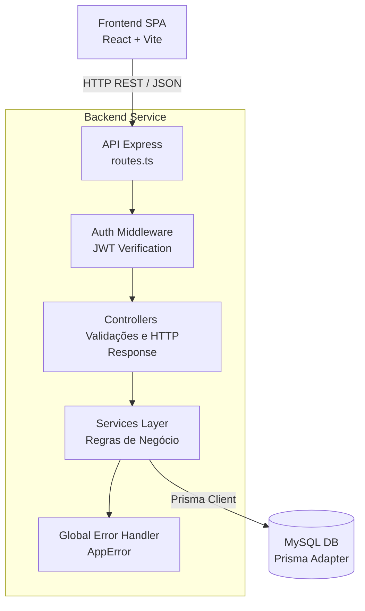

# Visão Geral do Sistema (System Overview)

Este documento descreve a arquitetura de alto nível do [Barbershop] SaaS System, detalhando as tecnologias empregadas e o fluxo de interação entre as camadas.

## Stack Tecnológico

A aplicação adota uma stack moderna baseada no ecossistema JavaScript/TypeScript, construída sobre os seguintes pilares:

- **Frontend:** Desenvolvido em **React**, provido via **Vite** para HMR ultrarrápido na fase de build/desenvolvimento. A estilização fica a cargo do **Tailwind CSS**. A comunicação com o servidor é assíncrona, orquestrada por instâncias isoladas do `Axios`.
- **Backend:** Servidor estruturado em **Node.js** utilizando o framework **Express (versão 5.x)**, que fornece suporte nativo ao tratamento de *Promise Rejections*, abolindo a necessidade excessiva de try/catch para erros de I/O em rotas assíncronas.
- **Camada de Dados (Database):** Banco de dados relacional **MySQL** (conectado localmente via driver MariaDB). O mapeamento objeto-relacional (ORM) e o tracking das migrações são estritamente geridos pelo **Prisma**.

## Modelo de Interação (Client-Server)

O sistema segue a arquitetura clássica *Client-Server* através de uma API RESTful. O frontend opera como uma *Single Page Application* (SPA), encapsulando lógicas de sessão via JWT (JSON Web Tokens) guardados no contexto HTTP dinâmico. 

> [!NOTE]
> Toda lógica massiva de rateio financeiro, dedução de créditos contratuais e cálculos proporcionais são delegados isoladamente para o Backend. Isso previne manipulações indevidas na interface e assegura o modelo ACID através do envio da transação ao banco.

## Fluxo Arquitetural (Data Flow)

