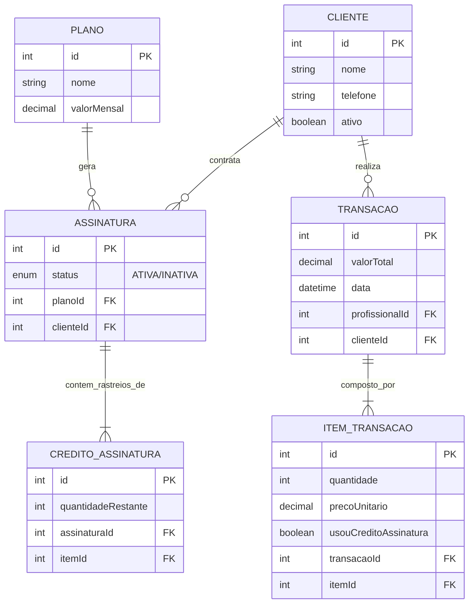

# Esquema do Banco de Dados (Database Schema)

O banco de dados é um banco relacional gerenciado e mapeado integralmente via Prisma. Ele foi designado com foco em integridade referencial nas finanças dos planos de contrato e no *ledger* (livro contábil) das transações de cada salão.

## Overview das Entidades Core

- **Profissional**: Usuários/Colaboradores que atendem no sistema, protegidos por `hashed` senhas.
- **Cliente**: Tabela base de consumidores; podem possuir N `Assinaturas` ativas de determinados `Planos`.
- **Transacao**: A ponta primária de faturamento do sistema. Armazena os dados brutos de quem efetuou a compra (`clienteId`), qual método de pagamento e qual profissional prestou o serviço.
- **Assinatura & Plano**: Contrato ativo entre um cliente e o barbeiro/salão. Traz uma hierarquia de cotas de serviços.
- **CreditoAssinatura**: Entidade de rastreamento. Representa quantos cortes ou tratamentos ("ItemCatalogo") restam ainda no mês para aquele plano específico daquele respectivo cliente.

## Lógica de Contenção de Créditos (Subscriptions)

> [!IMPORTANT]
> Quando um cliente contrata determinada assinatura (ex: "Plano Premium Mensal"), um cron de negócio é acionado no backend criando um lote fixo no `CreditoAssinatura`. Toda transação associada ao seu `clienteId` abaterá diretamente esse banco de cotas — gerando dados proporcionais ao invés de valores comerciais inteiros para alimentar os dashboards de caixa sem perdas virtuais.

## Diagrama Entidade-Relacionamento (ERD)

